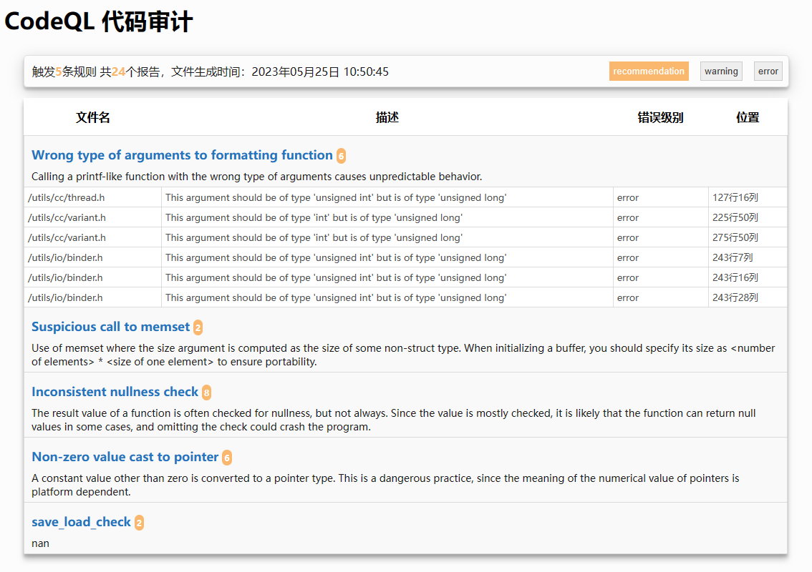

# 说明

一个负责将`codeql-cli`输出的`csv`文件转变为`html`的`python3`程序

**If you are using English, please click ->** [REMADE_EN.md](docs/README_EN.md)



## 依赖

使用`pandas`读取`csv`文件，所以需要安装`pandas`库，像下面这样

+ `pip3 install pandas`

## 运行

下面是正常的使用方式

```shell
# codeql 生成数据库，得到db文件夹
codeql database create ~/db --language=cpp --overwrite --command="make -j20"

# 分析数据得到csv文件
codeql database analyze ~/db --format=csv --output=./db.csv

# 使用脚本转换csv为html
python3 codeql-csv2html.py template.html ctest.csv index.html
```

## 修改样式

如果想要修改样式，修改`template.html`即可，为了减少文件数量，建议`css`和`javascript`代码都写入`template.html`文件内

## 增加过滤条目

`codeql`本身对于解释型语言是提供指定代码扫描目录功能的，但是对于`C++`这样的编译型语言似乎没有这样的支持（如果有，请告诉我）。所以这个程序支持针对文件名进行过滤。

如果需要，只需要修改`filter.py`文件，在`filter_list`列表中添加正则表达式即可

如果需要对正则表达式进行测试，测试用例添加到`test_list`，并且运行`filter.py`即可

