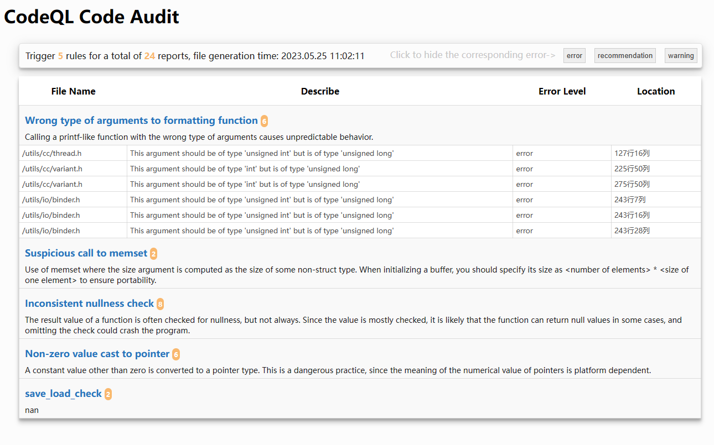

# Illustrate

A 'python3' program responsible for converting the 'csv' file output from 'codeql cli' to 'HTML'

**如果你使用中文，点击这个 ->** [REMADE.md](../README.md)



## Dependent 

To read the `csv` file using `pandas`, it is necessary to install the `pandas` library, as shown below

+ `pip3 install pandas`

## Run

The following is the normal usage method

```shell
# Codeql generates a database and obtains the db folder
codeql database create ~/db --language=cpp --overwrite --command="make -j20"

# Analyze data to obtain CSV files
codeql database analyze ~/db --format=csv --output=./db.csv

# Converting CSV to HTML using scripts
python3 codeql-csv2html.py template.html ctest.csv index.html
```

## Modify Style

If you want to modify the style, simply modify `template. html`. To reduce the number of files, it is recommended to write both `CSS` and `JavaScript` code into the `template. html` file

## Add Filter Entry

`Codeql` itself provides the ability to scan directories for specified code for interpreted languages, but it does not seem to have such support for compiled languages such as `C++` (if so, please let me know). So this program supports filtering for file names.

If necessary, simply modify the `filter. py` file and add it to the `filter_list` Add a regular expression to the list

If you need to test regular expressions, add test cases to `test_list` and run `filter. py` to complete the task

